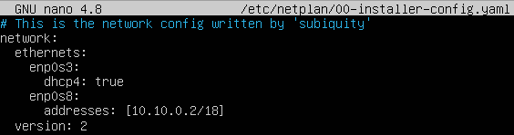

# Сети в Linux
Настройка сетей в Linux на виртуальных машинах.
##  Содержание
   1. [Инструмент ipcalc](#part-1-инструмент-ipcalc)
   2. [Статическая маршрутизация между двумя машинами](#part-2-статическая-маршрутизация-между-двумя-машинами)
   3. [Утилита iperf3](#part-3-утилита-iperf3)
   4. [Сетевой экран](#part-4-сетевой-экран)
   5. [Статическая маршрутизация сети](#part-5-статическая-маршрутизация-сети)
   6. [Динамическая настройка IP с помощью DHCP](#part-6-динамическая-настройка-ip-с-помощью-dhcp)
   7. [NAT](#part-7-nat)
## Part 1. Инструмент **ipcalc**
1. Сети и маски.<br>
    использованные команды:
    * `ipcalc 192.167.38.54/13`<br>
    
    * `ipcalc 192.167.38.54 255.255.255.0`<br>
    
    * `ipcalc 192.167.38.54/15`<br>
    
    * `ipcalc 192.167.38.54 255.255.255.240`<br>
    
    * `ipcalc 12.167.38.4/8 && ipcalc 12.167.38.4 255.255.0.0 && ipcalc 12.167.38.4 255.255.254.0`<br>
    
2. localhost
    * Обратиться можно к приложению на localhost с IP: 127.0.0.2, 127.1.0.1
3. Диапазоны и сегменты сетей.
* публичные IP:<br>
 134.43.0.2, 172.0.2.1, 192.172.0.1, 172.68.0.2, 192.169.168.1
* частные IP:<br>
 10.0.0.45, 192.168.4.2, 172.20.250.4, 172.16.255.255, 10.10.10.10
* у сети 10.10.0.0/18 возможны следующие IP-адреса:<br>
 10.10.0.2, 10.10.10.10, 10.10.1.255
## Part 2. Статическая маршрутизация между двумя машинами
использованные команды:
* `ip a`<br>

*  задаем статические адреса и маски для машин ws1 и ws2 с помощью 00-installer-config.yaml <br>

* `sudo netplan apply`
* `sudo ip r add 192.168.100.10 dev enp0s3`
* `sudo ip r add 172.24.116.8 dev enp0s3`
* `ping -c 5 192.168.100.10`
* `ping -c 5 172.24.116.8` <br>

* статический маршрут от одной машины до другой с помощью файла etc/netplan/00-installer-config.yaml <br>

## Part 3. Утилита **iperf3**
Перевести и записать в отчёт: 8 Mbps в MB/s, 100 MB/s в Kbps, 1 Gbps в Mbps
* 8 Mbps = 1 MB/s
* 100 MB/s = 819200 Kbps
* 1 Gbps = 1024 Mbps

использованные команды:
* на машине ws1 `iperf3 -s`
* на машине ws2 `iperf3 -c 192.168.100.10`

## Part 4. Сетевой экран
Создать файл /etc/firewall.sh, имитирующий фаерволл, на ws1 и ws2
использованные команды:
* `chmod +x /etc/firewall.sh && /etc/firewall.sh` <br>

* проверка на соответствие заданию: соответствует <br>

## Part 5. Статическая маршрутизация сети
### 5.1. Настройка адресов машин
* Настроить конфигурации машин в etc/netplan/00-installer-config.yaml согласно сети на рисунке.
* роутер r1 <br>

* роутер r2 <br>

* машина ws11 <br>

* машина ws21 <br>

* машина ws22 <br>

* Перезапустить сервис сети. `sudo netplan apply`
* Если ошибок нет, то командой `ip -4 a` проверить, что адрес машины задан верно.
* роутер r1 <br>

* роутер r2 <br>

* машина ws11 <br>

* машина ws21 <br>

* машина ws22 <br>

* Скрин пинга `ws22` с `ws21`. <br>

* Скрин пинга `r1` с `ws11`. <br>

### 5.2. Включение переадресации IP-адресов.
* Для включения переадресации IP, выполните команду на роутерах: `sysctl -w net.ipv4.ip_forward=1` При таком подходе переадресация не будет работать после перезагрузки системы. Cкрин с вызовом и выводом использованной команды.

* Откройте файл `/etc/sysctl.conf` и добавьте в него следующую строку: `net.ipv4.ip_forward = 1` При использовании этого подхода, IP-переадресация включена на постоянной основе.
* роутер r1

* роутер r2

### 5.3. Установка маршрута по-умолчанию
* Пример вывода команды ip r после добавления шлюза:
```
default via 10.10.0.1 dev eth0
10.10.0.0/18 dev eth0 proto kernel scope link src 10.10.0.2
```
* Настроить маршрут по-умолчанию (шлюз) для рабочих станций. Для этого добавить gateway4 [ip роутера] в файле конфигураций. Вызвать `ip r` и показать, что добавился маршрут в таблицу маршрутизации

* Пропинговать с ws11 роутер r2 и показать на r2, что пинг доходит. Для этого использовать команду: `tcpdump -tn -i eth1`

### 5.4. Добавление статических маршрутов
* Добавим в роутеры r1 и r2 статические маршруты в файле конфигураций. 
* роутер r1 <br>

* роутер r2 <br>

* Вызовем команду ip r: <br>

* Вызов команд ip r list 10.10.0.0/18 и ip r list 0.0.0.0/0 на ws11: <br>

* Для адреса 10.10.0.0/18 был выбран маршрут, отличный от 0.0.0.0/0, поскольку он является адресом сети и доступен без шлюза.
### 5.5. Построение списка маршрутизаторов
* Запуск на r1 команды дампа `tcpdump -tnv -c 12 -i enp0s8` и построение списка маршрутизаторов на пути от ws11 до ws21 при помощи утилиты `traceroute`

* Для определения промежуточных маршрутизаторов traceroute отправляет целевому узлу серию ICMP-пакетов (по умолчанию 3 пакета), с каждым шагом увеличивая значение поля TTL («время жизни») на 1. Это поле обычно указывает максимальное количество маршрутизаторов, которое может быть пройдено пакетом. Первая серия пакетов отправляется с TTL, равным 1, и поэтому первый же маршрутизатор возвращает обратно ICMP-сообщение «time exceeded in transit», указывающее на невозможность доставки данных. Traceroute фиксирует адрес маршрутизатора, а также время между отправкой пакета и получением ответа (эти сведения выводятся на монитор компьютера). Затем traceroute повторяет отправку серии пакетов, но уже с TTL, равным 2, что заставляет первый маршрутизатор уменьшить TTL пакетов на единицу и направить их ко второму маршрутизатору. Второй маршрутизатор, получив пакеты с TTL=1, так же возвращает «time exceeded in transit».
* Процесс повторяется до тех пор, пока пакет не достигнет целевого узла. При получении ответа от этого узла процесс трассировки считается завершённым.
* На оконечном хосте IP-датаграмма с TTL = 1 не отбрасывается и не вызывает ICMP-сообщения типа срок истёк, а должна быть отдана приложению. Достижение пункта назначения определяется следующим образом: отсылаемые traceroute датаграммы содержат UDP-пакет с заведомо неиспользуемым номером порта на адресуемом хосте. Номер порта будет равен 33434 + (максимальное количество транзитных участков до узла) — 1. В пункте назначения UDP-модуль, получая подобные датаграммы, возвращает ICMP-сообщения об ошибке «порт недоступен». Таким образом, чтобы узнать о завершении работы, программе traceroute достаточно обнаружить, что поступило ICMP-сообщение об ошибке этого типа
### 5.6. Использование протокола ICMP при маршрутизации
* Запуск на r1 перехвата сетевого трафика, проходящего через enp0s8 с помощью команды `tcpdump -n -i enp0s8` icmp и пинг с ws11 несуществующего IP `ping -c 1 10.30.0.111`:

## Part 6. Динамическая настройка IP с помощью **DHCP**
* Содержание файла /etc/dhcp/dhcpd.conf для r2 с конфигурацией службы DHCP

* Содержание файла /etc/resolf.conf для r2 с конфигурацией службы DHCP

* Перезагрузить службу DHCP командой `systemctl restart isc-dhcp-server`. Машину ws21 перезагрузить при помощи reboot и через `ip a` показать, что она получила адрес. Также пропинговать ws22 с ws21.

* Указать MAC адрес у ws11, для этого в etc/netplan/00-installer-config.yaml надо добавить строки: macaddress: 10:10:10:10:10:BA, dhcp4: true <br>

* Содержание файла /etc/dhcp/dhcpd.conf для r1 с конфигурацией службы DHCP

* Содержание файла /etc/resolf.conf для r1 с конфигурацией службы DHCP

* Перезагрузить службу DHCP командой `systemctl restart isc-dhcp-server`. Машину ws11 перезагрузить при помощи reboot и через `ip a` показать, что она получила адрес. 

* Запрос обновления ip адреса с ws21
* Команда `sudo dhclient -r enp0s8` освобождает текущий адрес интерфейса enp0s8. Команда `sudo dhclient enp0s8` задает новый адрес указанному интерфейсу.

## Part 7. **NAT**
* Содержание файла /etc/apache2/ports.conf на ws22 и r2 (строка Listen 80 изменена на Listen 0.0.0.0:80):

* Запустить веб-сервер Apache командой `service apache2 start` на ws22 и r1:

* Добавить в фаервол, созданный по аналогии с фаерволом из Части 4, на r2 правила

* Проверить соединение между ws22 и r1 командой ping

* Разрешить маршрутизацию всех пакетов протокола ICMP

* Проверка соединения между ws22 и r1 командой ping  <br>

* Добавляем в iptables ещё несколько правил
* Включить SNAT, а именно маскирование всех локальных ip из локальной сети, находящейся за r2 
* Включить DNAT на 8080 порт машины r2 и добавить к веб-серверу Apache, запущенному на ws22, доступ извне сети <br>

* Проверить соединение по TCP для SNAT, для этого с ws22 подключиться к серверу Apache на r1 командой `telnet 10.100.0.11 80` <br>

* Проверить соединение по TCP для DNAT, для этого с r1 подключиться к серверу Apache на ws22 командой `telnet 10.20.0.20 8080` <br>
